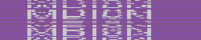

Challenge 8
-----------

Challenge Endpoint: `http://challenges.enigmagroup.org/programming/8/`

> Your objective is to analyze the following [random] image (`/8/image.php`)
> and report back the unscrambled image text.
>
> Example:
>
> 
>
> You will submit the answer back to the image page (under POST), using the
> variables: answer=unscrambled image text&submit=1
>
> You have one second to analyze the image and submit it back to the image page.

The image is non-static and refreshes with each request.
