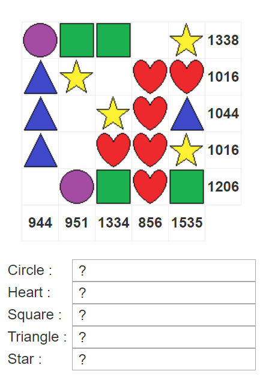

Challenge 9
-----------

Challenge Endpoint: `http://challenges.enigmagroup.org/programming/9/`

> Your objective is to anaylze the shapes in the grid and find their values.
>
> The corresponding values of the shapes will add up to the totals on the right
> side and bottom of the grid. Each shape has only one positive value and blank
> slots equal 0.
>
> A refresh will cause all shapes to receive new values. Use the form below to
> submit back your answers once all the shape values are found. You have 2
> seconds to complete this mission.
>
> Example:
>
> 

The grid is non-static and refreshes with each request.
